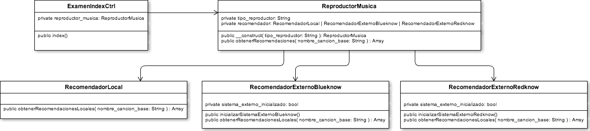

Ejercicio del Máster en Programación Web de Alto Rendimiento
===================

Descripción del sistema
------------------

* El sistema está compuesto por 5 clases principales, todas ellas con “métodos fake” para poder simplificar.
* Deberás acceder al sistema desde el index.php, script que únicamente se encarga de cargar el autoloader y ejecutar el método index de la clase ExamenIndexController.
* Nuestro sistema supuestamente se encarga de gestionar un reproductor de música (clase ReproductorMusica) a través de un único controlador (clase ExamenIndexCtrl).
* Entendemos que el reproductor (ReproductorMusica) puede ser de 3 tipos: 'local', 'spotify' o 'google_play'. Esto se indica a través del atributo de clase 'tipo_reproductor'.
* El reproductor delega la gestión de las recomendaciones en una clase externa. Decidiremos qué clase externa hace de recomendador en función del tipo de reproductor. Es decir:
    * Atributo 'tipo_reproductor' con valor 'local'			=> 'recomendador' será de tipo 'RecomendadorLocal'
    * Atributo 'tipo_reproductor' con valor 'spotify'		=> 'recomendador' será de tipo 'RecomendadorExternoBlueknow'
    * Atributo 'tipo_reproductor' con valor 'google_play'	=> 'recomendador' será de tipo 'RecomendadorExternoRedknow'
* Los 3 recomendadores se engloban en dos tipos:
    * RecomendadorLocal: Local (no necesita ser inicializado para pedir recomendaciones).
    * RecomendadorExternoBlueknow y RecomendadorExternoRedknow: Remoto (necesitan ser inicializados antes de poder pedir recomendaciones).

Diagrama inicial de clases del dominio
------------------

Ejercicios
------------------

* Mejora la modularidad de la clase ReproductorMusica aplicando el principio Open/Close.
* Ahora la clase ReproductorMusica estaría acoplada con las 3 clases de gestión de recomendaciones. Invierte esa dependencia.
* Haz el diagrama de clases del dominio resultante tras aplicar las modificaciones.